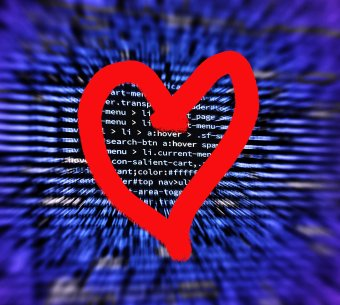
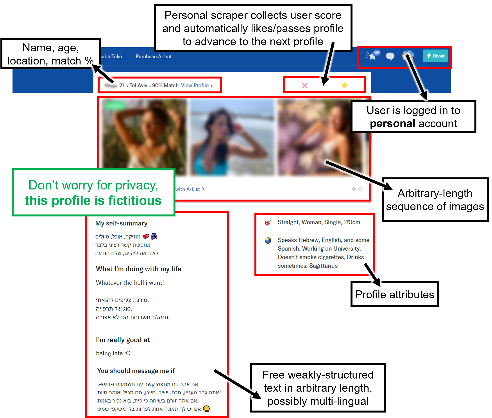
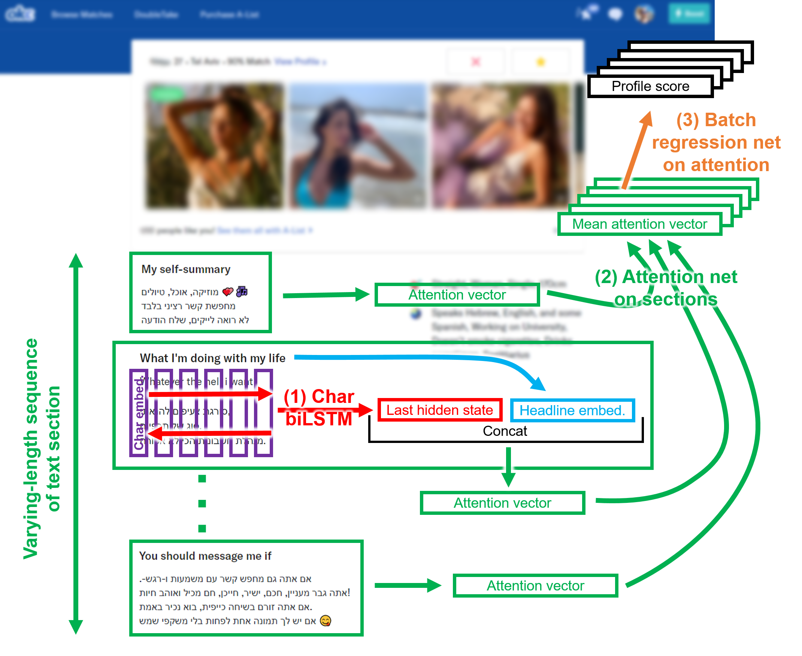
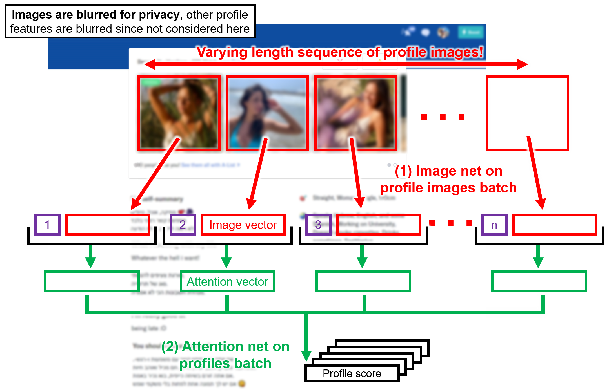

# DatingAI
**(last update: 2019/12/06)**

* *Around the beginning of 2019* I started DatingAI as a personal research project, to develop and research AI to learn personal taste in dating sites, and function as a personal dating bot. You can read more [here](https://ozzisphere.wordpress.com/2019/02/02/dating-ai-project/).

* *Around the end of 2019* I also started DatingAI community project, to build a **honest** AI dating system to help as many users as possible in making matches that lead to **meaningful** relationships, **the opposite** of current online dating sites/apps. You can read more [here](https://ozzisphere.wordpress.com/2019/09/29/datingai-the-community-matchmaking-phase/). We are working on it in [DatingAI Facebook group](https://www.facebook.com/groups/DatingAI/) (Hebrew!).

**This repo presents only my original DatingAI personal research project, not the community project!**

  

---
DatingAI started as a personal research project that I created for my interest, challenge and experience, and also to demonstrate my skills (for past job searching), aiming to learn:

1. **Learn personal taste in dating sites:**
    1. How to predict personal taste (represented by the scores that a user gives to profiles) by neural networks.
    2. How different profile features - images, numerical/categorical features (age, location...), text - affect the personal taste of a user.
    3. How to represent personal taste and profile embedding, what clusters exist and how they depend on the scoring scale...
2. **Develop a personal dating agent** that automatically likes/passes and messages profiles according to the user personal taste learned.

Since OK Cupid is a top global dating site and offers a web interface that sequentially presents profiles to the logged user when liking/passing them (DoubleTake), I built a personal scraper that allows any user to locally save all data that is presented:

  

The challenge is to develop and integrate learning:
1. A varying-length sequence of images (for which I developed a **self-attention net**).
2. A varying-length sequence of weakly-structured optional text sections, in possibly a few intertwined languages, e.g. in Israel – English, Hebrew, Emojis (for which I developed an **attentive character-level bi-LSTM**).
3. Categorical features (location, habits…) that require sparse/dense embeddings.
4. Numerical features (age, height…).

# Main neural net architectures

## Learning text with an attentive char-level bi-LSTM ([see notebook](https://github.com/Ozziko/DatingAI/blob/master/Text_attentive_char_biLSTM_score_regression.ipynb))

  

## Learning image sequences with self-attention ([see notebook](https://github.com/Ozziko/DatingAI/blob/master/Image_sequence_self_attentive_score_regression.ipynb))

  

# Project Roadmap
1. (100%) **Developing a Personal Cupid Scraper**: a Python script that opens a Chrome browser (selenium-driven) for a user to login into the personal OK Cupid account, scrapes all data (textual+images) from the profiles suggested in DoubleTake, then for each profile it asks the user to give a score and accordingly likes/passes the profile and advances to the next profile. All data – text fields, images and the user scores – is saved locally on the disk.

2. (100%) **Developing an image score classification:** for each image, predicting the score class given to the profile to which the image belongs. Developing a PyTorch dataset (with augmentation), train/validation dataloaders, net configurations (mine & pretrained models), training, evaluation metrics, saving/loading weights.

3. (100%) **Developing an image score regression ([see notebook](https://github.com/Ozziko/DatingAI/blob/master/Image_score_regression.ipynb)):** for each image, predicting the score value given to the profile to which the image belongs (with a few net architectures, including Inception v3). *This assumes that all images in each profile are independent and given the same score (of their profile), which is obviously a simplification*. Why regression suits better than classification, as in (2): instead of predicting the image score *class*, this architecture predicts the image score *value* - *to take into consideration the distance between scores in the loss*, e.g. for a target score of +3, predicting -1 (err=4) should be much worse than predicting +2 (err=1), but in classification the penalty on both mistakes is the same.

4. (100%) **Developing a text attentive char bi-LSTM score regression ([see notebook](https://github.com/Ozziko/DatingAI/blob/master/Text_attentive_char_biLSTM_score_regression.ipynb)):** predicting the user score given for each profile based on the free text that is written in the profile, which is weakly-structured - there are many kinds of optional sections to fill freely, e.g. 'My self-summary', "What I'm doing with my life", 'I value', etc. (1) The text on each section is encoded by a character level bi-LSTM, since I deal with text of Israeli profiles - intertwined English, Hebrew & Emojis, where Hebrew is right-to-left, and highly inflected (which makes it highly efficient). (2) An attention net summarizes all sections in each profile, where the inputs for each section are the embedding of the section headline and the bi-LSTM state vector achieved by operating on the section text. (3) A final regression net transforms the final attention output into a profile score.

5. (100%) **Developing an image sequence self-attentive score regression ([see notebook](https://github.com/Ozziko/DatingAI/blob/master/Image_sequence_self_attentive_score_regression.ipynb)):** predicting the user score given for each profile based on the entire *varying-length* sequence of images appearing in the profile. This is a generalization of (3), image score regression, that assumed that the images are independent - predicting *for each image* the score given to the profile to which the image belongs.

6. (10%) **Developing a score regression net for all the rest of the profile features -** all profile features that are not free text or images (e.g. age, location, height, languages, etc.), using embeddings when needed.   

7. (0%) **Integrating (4)-(6) nets into a single regression net**, to be trained together with some attention on final results to find the importance of the different nets, using the different profile features. 

8. (0%) **Researching the representation of personal taste and profile in embedded spaces, clustering, etc.**

8. (0%) **Developing a personal dating agent:** automatically likes/dislikes profiles and messages them according to learned user taste.

# About me
I have an M.Sc. in physics from the Weizmann Institute and a B.Sc. in physics from the Technion, and changed field of expertise from a Ph.D. in astrophysics to artificial intelligence. **I am experienced with shallow/deep learning, NLP, computer vision, time series. I keep up-to-date** by constantly reading papers, listening to podcasts, attending conferences and meetups, experimenting. See my personal & community projects below.

I am an excellent autodidact, very curious, **I deeply like learning, researching and solving challenges.**

---
**I would be glad for any comment, question or discussion!**

You can contact me at oz.livneh@gmail.com or find me at www.linkedin.com/in/oz-livneh.

Yours,

Oz Livneh
